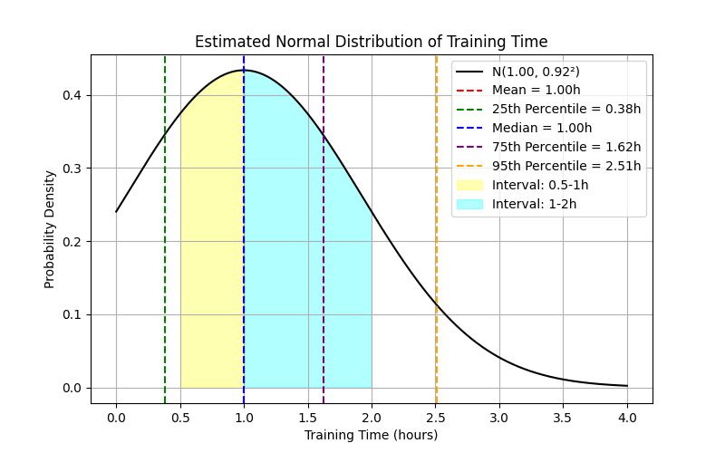

本项目通过在服务端爬取 MSU 健身房实时人数数据（时间粒度五分钟，多了阿里云要炸），对当前人数进行了预测。人数衰减量我们默认个体的单次健身时长遵循正态分布。
具体来说，我们通过参考了“美国成年人健身房训练时长统计分析”的数据，并对其拟合了概率密度函数（具体实现过程[参考](https://charmingzh.github.io/IsItBusy/about.html)）。

# 1. 如何使用

首先，使用浏览器打开（[🌧Sweat Scheduler | MSU 健身房人浪预报🌊](https://charmingzh.github.io/IsItBusy/)）小程序，然后按照如下步骤可以添加到桌面，方便随时访问。

  
  

（使用手机获得最佳体验哦。）

# 2. 美国成年人健身房训练时长统计分析

> 根据 **（Statista，2021）[1]** 的数据显示：
> 
>  **18-34** 岁的年轻人（31%）和 **35-54** 岁的成年人（31%）是健身房的最大客群。
> 其中，女性平均每天花 **0.3** 小时进行体育、娱乐和锻炼，而男性平均每天花 **0.44** 小时。
> 
> > - 约 **21%** 的健身爱好者每次训练花费 **0.5 ~ 1** 小时；
> > - 约 **35%** 的健身爱好者每次训练花费 **1 ~ 2** 小时；
> 

> 
> 

> 经过数值求解，本次估计得到的正态分布参数为 $N(\mu=1, \sigma=0.92^2)$ 
> 
> 在该模型下：
> 
> - $P(0.5 \le X \le 1) \approx 20.7\%$（略低于 21%），
> - $P(1 \le X \le 2) \approx 36.1\%$（略高于 35%）。
> 
> 考虑到正态分布模型的连续性及其对称性，所得结果已较好地近似反映数据源给出的比例；

# 3. 最受欢迎的健身时段

最受欢迎的健身时间是清晨 5 点至 9 点，38% 的健身房会员在这个时间段健身。

> - 约 **29%** 的健身房会员在上午 9 点至中午期间健身。
>
> - 约 **25%** 的健身房会员在中午至下午 2 点期间健身。
>
> - 约 **20%** 的健身房会员在下午 2 点至 5 点期间健身。
>
> - 约 **25%** 的健身房会员在傍晚 5 点至 8 点期间健身。
>
> - 约 **16%** 的健身房会员在晚间 8 点至 11 点期间健身。

# 4. MSU 健身房真实实时人数预报

## 4.1 按年观察每周不同时刻的实时健身人数

  
  

## 4.2 不同年份特定日期的实时人数分布

  
  

  
  

  
  

  

## TODO List

- [x] 实时数据爬取；
- [x] 网页前端可视化实现；
- [x] 阿里云服务器部署；
- [x] 通过`crontab -e`实现了服务器爬取数据实时更新到`Github`（Github Action延迟问题解决）；
- [x] `index.html`, `about.html`页面上线！🎉（2025-02-22）
- [ ] 待获取到更多数据后，对实时人数衰减函数做进一步的优化；（目前使用的数据为全美数据，不具代表性）
- [ ] 好好写写历史数据分析；
- [ ] QJHBD；🎂
- [ ] 收集用户反馈并持续改进；
- [ ] ...

### References

- [Website] 101 Gym Membership Statistics to Know [Ref$^{[1]}$](https://gymdesk.com/blog/gym-membership-statistics/)
- [Source Code] Visualization of the Normal Distribution of Individual Training Time. [Ref$^{[2]}$](https://github.com/CharmingZh/IsItBusy/blob/master/analysis/normal_distribution.py)
- [Source Code] Visualization of the most favorite workout time. [Ref$^{[3]}$](https://github.com/CharmingZh/IsItBusy/blob/master/analysis/workout_time.py)
