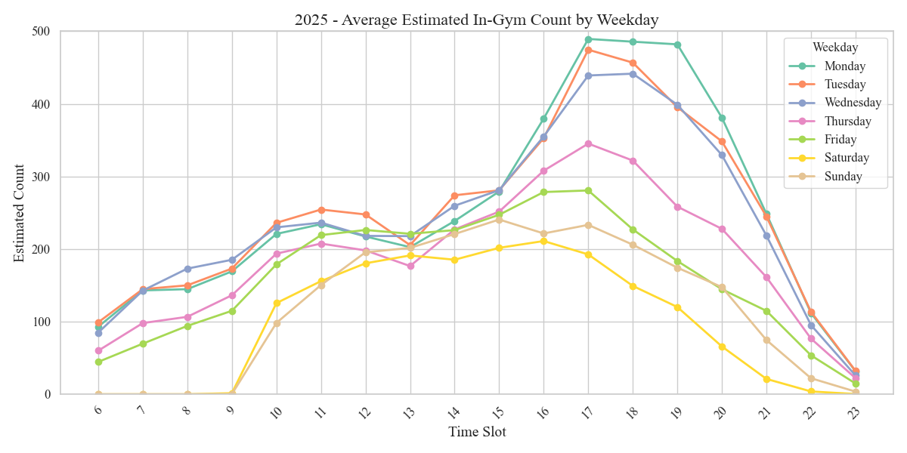

# 🏋️‍♂️ MSU 健身房人浪预报 🌊

    
 

Viz of 2025 Data and Runtime Demo.

本项目通过在服务器端爬取 MSU 健身房的实时人数增量数据（时间粒度五分钟，多了阿里云要炸），
并基于这些数据对健身房内的实时人数进行预测。对于人数衰减量，我们假设个体的单次健身时长服从正态分布。
具体来说，我们参考了“美国成年人健身房训练时长统计分析”的数据，并据此拟合了概率密度函数，以提高预测的准确性( [参考](https://charmingzh.github.io/IsItBusy/about.html) )。

> **🌍 English Version: [README_EN.md](README_EN.md)**

---
## 📌 目录
- [1. 如何使用](#1-如何使用)
- [2. 美国成年人健身房训练时长统计分析](#2-美国成年人健身房训练时长统计分析)
- [3. 全美国、全年龄段最受欢迎的健身时段](#3-全美国全年龄段最受欢迎的健身时段)
- [4. MSU 健身房真实实时人数预报](#4-msu-健身房真实实时人数预报)
- [☕ Buy Me a Coffee](#-buy-me-a-coffee)
- [📚 References](#references)
---
# 1. 如何使用

首先，使用浏览器打开（[🌧Sweat Scheduler | MSU 健身房人浪预报🌊](https://charmingzh.github.io/IsItBusy/)）小程序，然后按照如下步骤可以添加到桌面，方便随时访问。

  
  
  

（使用手机获得最佳体验哦。）

# 2. 美国成年人健身房训练时长统计分析

> 根据 **（Statista，2021）[1]** 的数据显示：
> 
>  **18-34** 岁的年轻人（31%）和 **35-54** 岁的成年人（31%）是健身房的最大客群。
> 其中，女性平均每天花 **0.3** 小时进行体育、娱乐和锻炼，而男性平均每天花 **0.44** 小时。
> 
> > - 约 **21%** 的健身爱好者每次训练花费 **0.5 ~ 1** 小时；
> > - 约 **35%** 的健身爱好者每次训练花费 **1 ~ 2** 小时；
> 

> 
> 

> 
[2]Visualization of the most favorite workout time.

> 
> 经过数值求解，本次估计得到的正态分布参数为 $N(\mu=1, \sigma=0.92^2)$ 
> 
> 在该模型下：
> 
> - $P(0.5 \le X \le 1) \approx 20.7\%$（略低于 21%），
> - $P(1 \le X \le 2) \approx 36.1\%$（略高于 35%）。
> 
> 考虑到正态分布模型的连续性及其对称性，所得结果已较好地近似反映数据源给出的比例；

# 3. 全美国、全年龄段最受欢迎的健身时段

> 同样是来自 **（Statista，2021）[1]** 的数据：最受欢迎的健身时间是清晨 5 点至 9 点，38% 的健身房会员在这个时间段健身。
> 
> - 约 **29%** 的健身房会员在上午 9 点至中午期间健身。
>
> - 约 **25%** 的健身房会员在中午至下午 2 点期间健身。
>
> - 约 **20%** 的健身房会员在下午 2 点至 5 点期间健身。
>
> - 约 **25%** 的健身房会员在傍晚 5 点至 8 点期间健身。
>
> - 约 **16%** 的健身房会员在晚间 8 点至 11 点期间健身。

[3]Visualization of the Normal Distribution of Individual Training Time.

# 4. MSU 健身房真实实时人数预报

## 4.1 按年观察每周不同时刻的实时健身人数

  
  

## 4.2 不同年份特定日期的实时人数分布

  
  

  
  

  
  

  

 

## TODO List

- [x] 实时数据爬取功能已实现，并成功部署至阿里云服务器，数据传输与联通测试均正常运行；（2025-02-20 🎉 可行性验证完成）
- [x] `index.html`, `about.html`页面！（2025-02-22 🎉第一版上线）
- [x] 成功实现数据仓库分离，妈妈再也不用担心我的`Github Action`爆仓啦！（Github Action延迟与限额问题解决）；
- [x] 开馆闭馆时间，营业时间指示牌🈺；
- [x] 中间加几个间隔的时间；（2025-02-24 🎉第二版上线）
- [x] QJHBD；🎂
- [x] 多尺寸窗口的自适应布局，确保在不同设备和屏幕分辨率下均能实现良好的可视化效果与用户体验；(目前仅针对：`iPhone 13/14`, `iPhone 16 Pro Max`, `iPad`用户进行了窗口优化。)
- [x] 实现春秋假期及正常营业时间的弹出窗口可视化，提升用户体验与数据直观性；（2025-03-01 ✅）
- [ ] ...

## ☕ Buy Me a Coffee

如果你觉得这个项目对你有帮助，可以请我喝杯咖啡支持一下！☕😊  
Your support keeps this project going! ❤️

### References

- [Website] 101 Gym Membership Statistics to Know [Ref$^{[1]}$](https://gymdesk.com/blog/gym-membership-statistics/)
- [Source Code] Visualization of the Normal Distribution of Individual Training Time. [Ref$^{[2]}$](https://github.com/CharmingZh/IsItBusy/blob/master/analysis/normal_distribution.py)
- [Source Code] Visualization of the most favorite workout time. [Ref$^{[3]}$](https://github.com/CharmingZh/IsItBusy/blob/master/analysis/workout_time.py)
