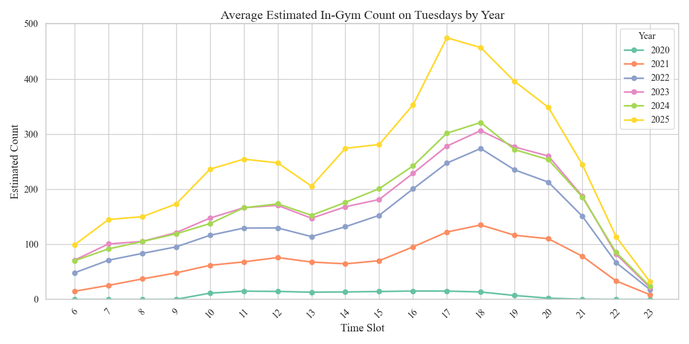
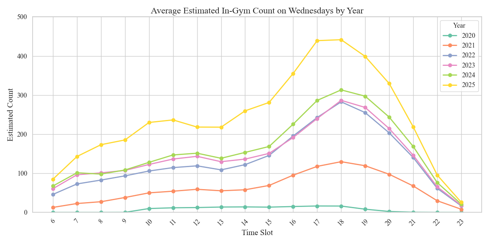
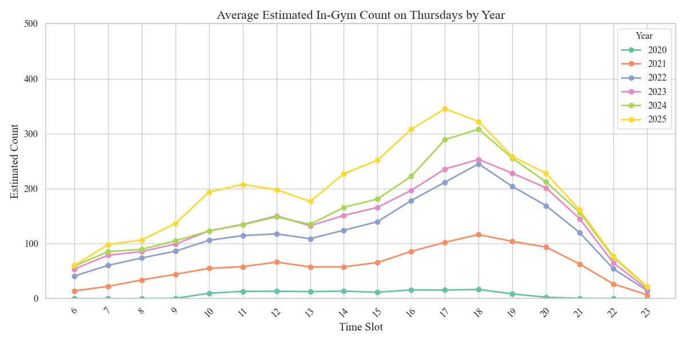

# 1. 如何使用

  
  
  

# 1. 美国成年人健身房训练时长统计分析

根据 **（Statista，2021）[1]** 的数据显示：

 **18-34** 岁的年轻人（31%）和 **35-54** 岁的成年人（31%）是健身房的最大客群。
其中，女性平均每天花 **0.3** 小时进行体育、娱乐和锻炼，而男性平均每天花 **0.44** 小时。

> - 约 **21%** 的健身爱好者每次训练花费 **0.5 ~ 1** 小时；
> - 约 **35%** 的健身爱好者每次训练花费 **1 ~ 2** 小时；

假设训练时间 $X$ 服从正态分布 $N(\mu, \sigma^2)$，则有：

1. **条件一**：
   $P(0.5 \le X \le 1) = \Phi\left(\frac{1-\mu}{\sigma}\right) - \Phi\left(\frac{0.5-\mu}{\sigma}\right) = 0.21,$
2. **条件二**：
   $P(1 \le X \le 2) = \Phi\left(\frac{2-\mu}{\sigma}\right) - \Phi\left(\frac{1-\mu}{\sigma}\right) = 0.35.$

其中 $\Phi(z)$ 表示标准正态分布的累积分布函数。

## 1.1 建立变量替换与方程

令
$A = \frac{1-\mu}{\sigma},$
同时令
$\delta = \frac{1}{\sigma} \quad \Longrightarrow \quad \sigma = \frac{1}{\delta}.$

此时，上述方程可写为：
- 条件一：
  $\Phi(A) - \Phi\Bigl(A - 0.5\delta\Bigr) = 0.21,$
- 条件二：
  $\Phi(A+\delta) - \Phi(A) = 0.35.$

这就是关于 $A$ 和 $\delta$ 的两个非线性方程。

## 1.2 数值求解

利用数值方法求解这两个方程，得到的近似结果为：
- $A \approx 0,$
- $\delta \approx 1.087.$

因此，有：
- $\sigma = \frac{1}{\delta} \approx \frac{1}{1.087} \approx 0.92 \text{ 小时},$
- $\mu = 1 - A\sigma \approx 1 - 0 \times 0.92 = 1 \text{ 小时}.$

验证
> - 对于条件一：
>   $\frac{0.5-\mu}{\sigma} = \frac{0.5-1}{0.92} \approx -0.5435,$
>   $\frac{1-\mu}{\sigma} = 0.$
>   则，
>   $P(0.5\le X\le 1)=\Phi(0)-\Phi(-0.5435)=0.5-\left(1-\Phi(0.5435)\right)=\Phi(0.5435)-0.5.$
>   查表得 $\Phi(0.5435) \approx 0.707$，因此 $P \approx 0.207$，接近 21%。
>
> - 对于条件二：
>   $\frac{2-\mu}{\sigma}=\frac{2-1}{0.92}\approx 1.087,$
>   $\frac{1-\mu}{\sigma}=0.$
>   则，
>   $P(1\le X\le 2)=\Phi(1.087)-0.5\approx 0.861-0.5=0.361,$
>   约为 36.1%，与 35% 也较为接近。

## 1.3 结论

经过严格的数值求解，本次估计得到的正态分布参数为：

- 均值 $\mu \approx 1$ 小时
- 标准差 $\sigma \approx 0.92$ 小时

在该模型下：

- $P(0.5 \le X \le 1) \approx 20.7\%$（略低于 21%），
- $P(1 \le X \le 2) \approx 36.1\%$（略高于 35%）。

考虑到正态分布模型的连续性及其对称性，所得结果已较好地近似反映题目给出的比例。实际应用中，可以根据更多数据进一步调整参数，以获得更准确的描述。

# 2. 最受欢迎的健身时段

最受欢迎的健身时间是清晨 5 点至 9 点，38% 的健身房会员在这个时间段健身。

> - 约 **29%** 的健身房会员在上午 9 点至中午期间健身。
>
> - 约 **25%** 的健身房会员在中午至下午 2 点期间健身。
>
> - 约 **20%** 的健身房会员在下午 2 点至 5 点期间健身。
>
> - 约 **25%** 的健身房会员在傍晚 5 点至 8 点期间健身。
>
> - 约 **16%** 的健身房会员在晚间 8 点至 11 点期间健身。

# 3. 历史数据

## 3.1 按年观察每周不同时刻的实时健身人数

## 3.2 不同年份特定日期的实时人数分布

### References

- [Website] 101 Gym Membership Statistics to Know [Ref$^{[1]}$](https://gymdesk.com/blog/gym-membership-statistics/)
- [Source Code] Visualization of the Normal Distribution of Individual Training Time. [Ref$^{[2]}$](https://github.com/CharmingZh/IsItBusy/blob/master/analysis/normal_distribution.py)
- [Source Code] Visualization of the most favorite workout time. [Ref$^{[3]}$](https://github.com/CharmingZh/IsItBusy/blob/master/analysis/workout_time.py)
