# 🏋️‍♂️ MSU Sweat Scheduler 🌊

   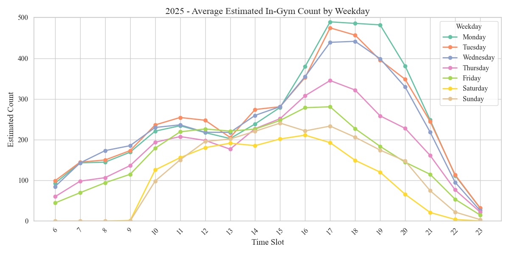 
   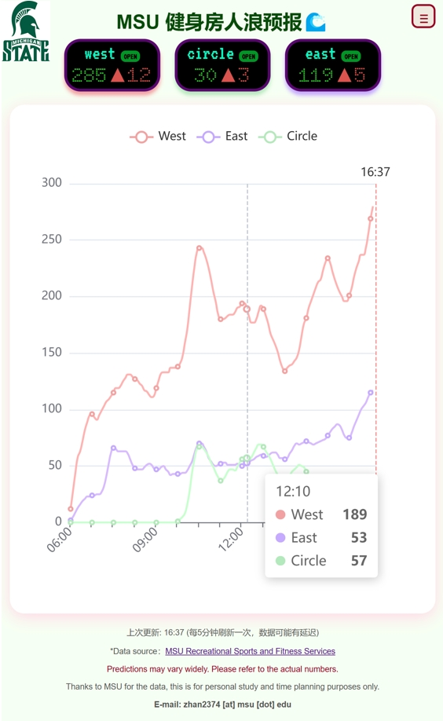

Visualization of 2025 Data and Runtime Demo.

This project collects real-time incremental data of gym occupancy at MSU from the server (time granularity: 5 minutes, too frequent may overload Aliyun). Based on this data, we predict the real-time number of people in the gym. For modeling the decay in gym occupancy, we assume individual workout durations follow a normal distribution.

Specifically, we refer to the **"Statistical Analysis of Gym Training Duration for U.S. Adults"**, and fit a probability density function (PDF) accordingly to improve prediction accuracy ([Reference](https://charmingzh.github.io/IsItBusy/about.html)).

---

## 📌 Table of Contents
- [1. How to Use](#1-how-to-use)
- [2. Statistical Analysis of Gym Workout Durations in the U.S.](#2-statistical-analysis-of-gym-workout-durations-in-the-us)
- [3. Most Popular Gym Workout Hours in the U.S.](#3-most-popular-gym-workout-hours-in-the-us)
- [4. Real-Time Gym Crowd Forecast for MSU](#4-real-time-gym-crowd-forecast-for-msu)
- [☕ Buy Me a Coffee](#-buy-me-a-coffee)
- [📚 References](#references)

---

# 1. How to Use

1. First, open the application in your browser ([🌧Sweat Scheduler | MSU 健身房人浪预报🌊](https://charmingzh.github.io/IsItBusy/)).  
2. Then, follow the steps below to add it to your home screen for quick access.

  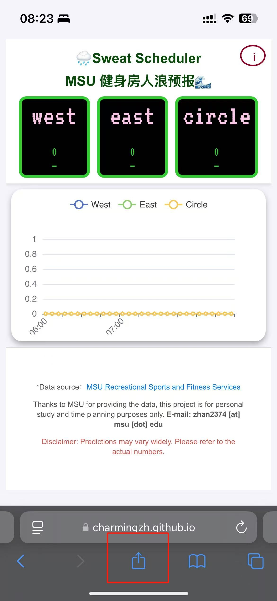
  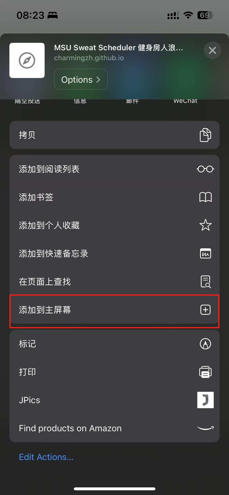
  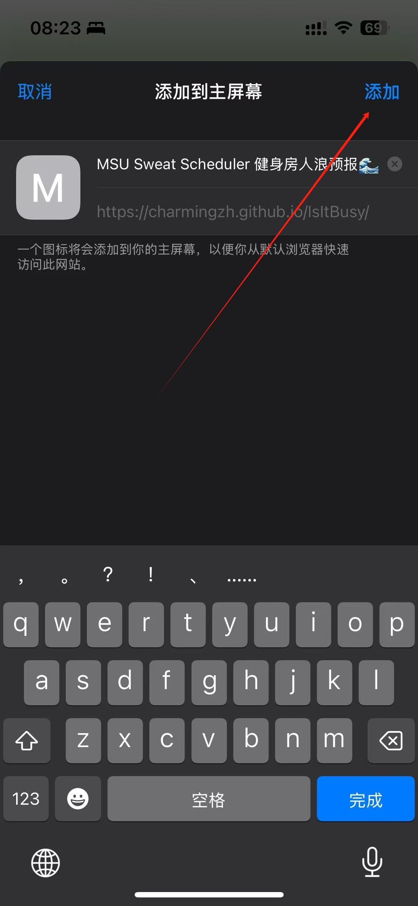

(Best experienced on mobile devices.)

---

# 2. Statistical Analysis of Gym Workout Durations in the U.S.

> According to **Statista (2021)[1]**:
>
> - Young adults aged **18-34** (31%) and adults aged **35-54** (31%) make up the largest gym-goer population.
> - On average, women spend **0.3 hours** per day on physical activities, while men spend **0.44 hours**.
>
> - **21%** of gym-goers train for **0.5 ~ 1 hour** per session.
> - **35%** train for **1 ~ 2 hours** per session.

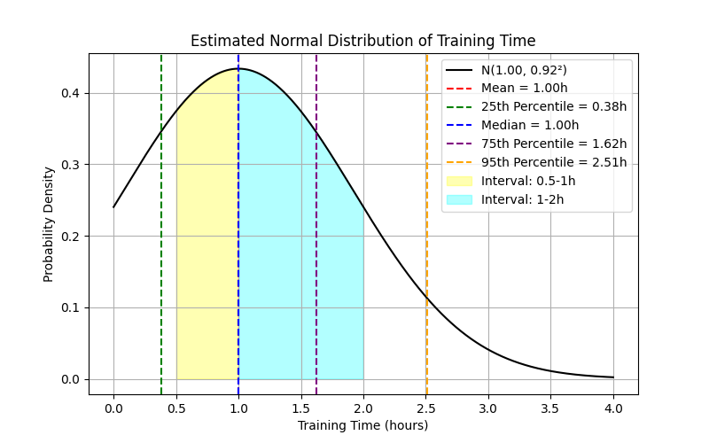

[2] Visualization of the most favorite workout duration.

Through numerical analysis, we estimate the normal distribution parameters as:  
$N(\mu=1, \sigma=0.92^2)$

Based on this model:
- $P(0.5 \le X \le 1) \approx 20.7\%$ (slightly lower than 21%).
- $P(1 \le X \le 2) \approx 36.1\%$ (slightly higher than 35%).

Considering the continuity and symmetry of the normal distribution, our estimation closely approximates the actual data proportions.

---

# 3. Most Popular Gym Workout Hours in the U.S.

> According to **Statista (2021)[1]**, the most popular gym hours are **5 AM - 9 AM**, when 38% of gym members work out.
>
> - **29%** prefer the **9 AM - noon** period.
> - **25%** go between **noon - 2 PM**.
> - **20%** train from **2 PM - 5 PM**.
> - **25%** visit the gym during **5 PM - 8 PM**.
> - **16%** train between **8 PM - 11 PM**.

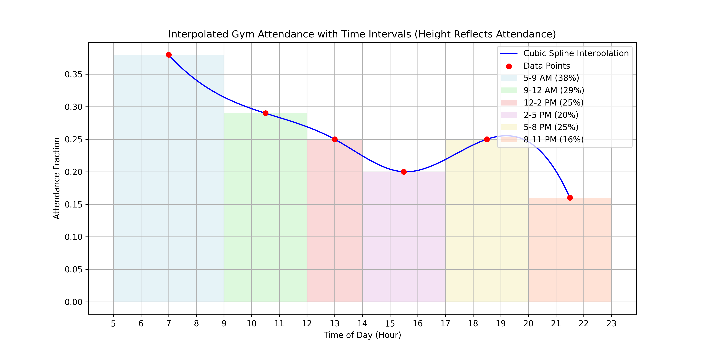

[3] Visualization of the most favorite workout hours.

---

# 4. Real-Time Gym Crowd Forecast for MSU

## 4.1 Weekly Gym Occupancy by Year

  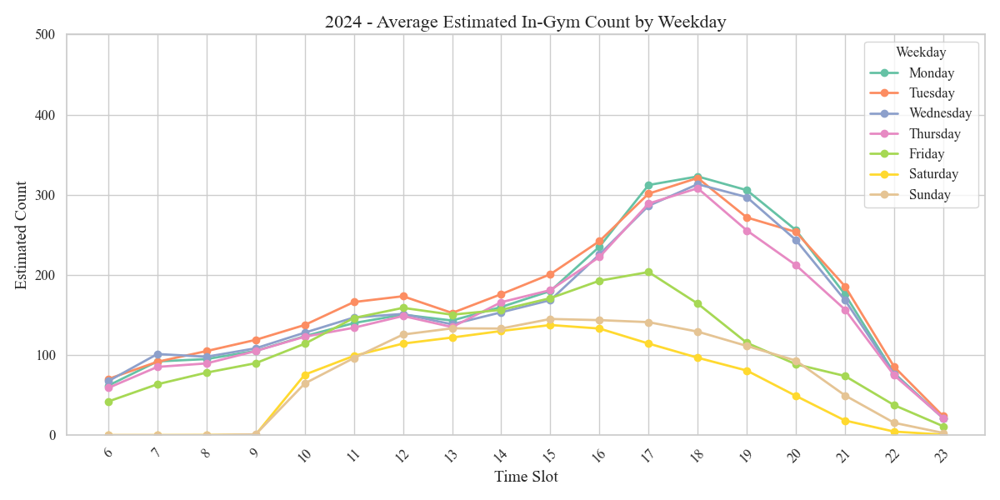
  

## 4.2 Real-Time Gym Crowd Distribution on Specific Days

  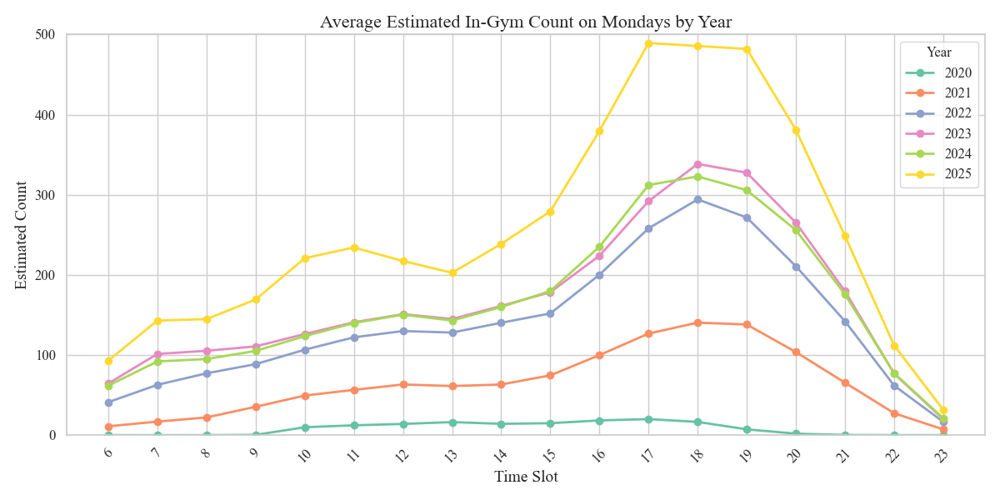
  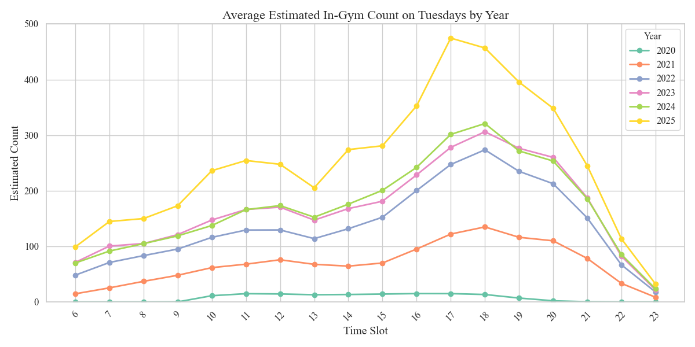

  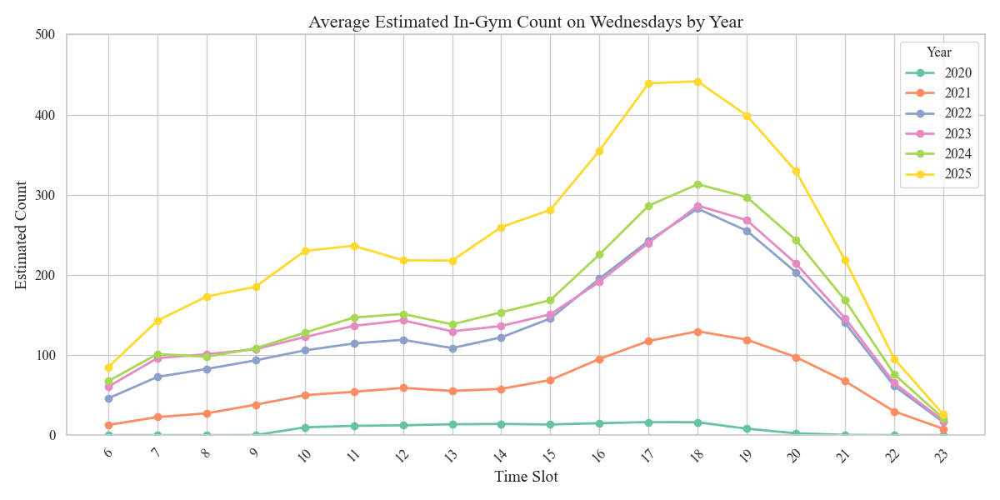
  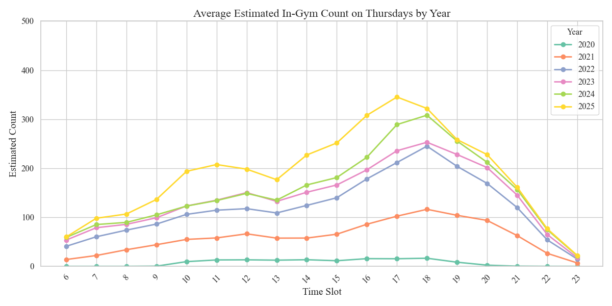

---

## ✅ TODO List

- [x] Real-time data collection and deployment on Aliyun 🎉 (2025-02-20 Feasibility Verified)
- [x] `index.html`, `about.html` pages launched 🎉 (2025-02-22)
- [x] Data storage separation, preventing GitHub Action overload!
- [x] Opening and closing hours visualization 🈺
- [x] Improved interval segmentation 🎉 (2025-02-24)
- [x] Multi-device responsive layout for an optimal user experience
- [x] Spring/Fall holiday and normal hours pop-up visualization ✅ (2025-03-01)
- [ ] More improvements...

---

## ☕ Buy Me a Coffee

If this project helps you, consider buying me a coffee! ☕😊  
Your support keeps this project going! ❤️

**Scan the WeChat QR Code to support me! 🙏**

---

## 📚 References

- [Website] **101 Gym Membership Statistics to Know** [Ref$^{[1]}$](https://gymdesk.com/blog/gym-membership-statistics/)
- [Source Code] **Normal Distribution of Training Duration** [Ref$^{[2]}$](https://github.com/CharmingZh/IsItBusy/blob/master/analysis/normal_distribution.py)
- [Source Code] **Most Popular Workout Time Visualization** [Ref$^{[3]}$](https://github.com/CharmingZh/IsItBusy/blob/master/analysis/workout_time.py)
